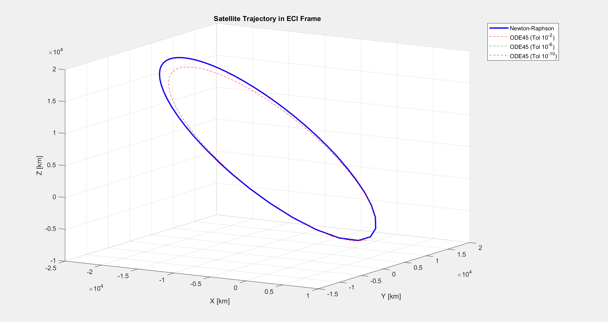
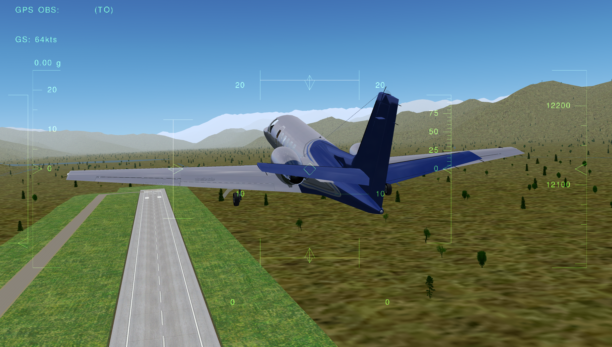

<!-- ABOUT ME SECTION AND SKILLS -->

<table style="width:100%; border-collapse:collapse; border:none; margin-bottom:20px;">
  <tr>

    <!-- LEFT COLUMN (60%) -->
    <td style="width:60%; vertical-align:top; padding-right:35px; border:none;">

      <h2 style="color:#000080; font-size:1.8em; margin-top:20px; margin-bottom:10px; font-family:sans-serif;">
        About Me
      </h2>

      

        Hi, my name is Mohana Kumanan, and I am an aerospace engineering student with a focus on control systems and orbital mechanics. I have experience in technical analysis, collaborative engineering projects, MATLAB, Simulink, numerical methods, and spacecraft dynamics. This website serves as a technical portfolio documenting the engineering methodologies, analyses, and computational tools developed throughout my projects.
      

    </td>

    <!-- RIGHT COLUMN (40%) -->
    <td style="width:40%; vertical-align:top; border:none;">

      <h2 style="color:#000080; font-size:1.8em; margin-top:20px; margin-bottom:10px; font-family:sans-serif;">
        Technical Skills
      </h2>

      
<strong>Programming</strong>

      

        MATLAB • Python • C++
      

      
<strong>Software</strong>

      

        Simulink • Stateflow • Solidworks • Ansys • FlightGear • STAR-CCM+ • Altium
      

     

    </td>

  </tr>
</table>

<!--     PROJECTS       SECTION  -->

<h2 style="color: #000080; font-size: 1.8em; margin-bottom: 6px; font-family: sans-serif;">
  Projects
</h2>

<h3 style="color: #000080; font-size: 1.4em; margin-bottom: 10px; text-align: center; font-family: sans-serif;">
  Kepler’s Problem Solver & Orbital Propagation
</h3>

  

    <ul style="color:#444; line-height:1.6; margin-top:6px; margin-bottom:12px; padding-left:20px; font-family:sans-serif;">
    <li>Solved Kepler's equation using the Newton–Raphson iterative method.</li>
    <li>Computed Classical Orbital Elements (COEs).</li>
    <li>Verified conservation of orbital energy and angular momentum.</li>
    <li>Transformed states between perifocal and ECI reference frames.</li>
    </ul>

<a href="kepler-solver.html" class="project-button">
  View More Details
</a>

  

  

    

         

      Comparison of Newton-Raphson to ODE45
    

    
  

<h3 style="color: #000080; font-size: 1.4em; margin-bottom: 10px; text-align: center; font-family: sans-serif;">
  Pitch Autopilot Controller Model
</h3>

  

    <ul style="color:#444; line-height:1.6; margin-top:6px; margin-bottom:12px; font-family:sans-serif;">
    <li>Designed a PID controller with anti-windup and actuator dynamics.</li>
    <li>Implemented Kalman filtering for robust state estimation.</li>
    <li>Evaluated controller performance using step, doublet, and square-wave reference inputs.</li>
    <li>Visualized aircraft response through real-time FlightGear 6DOF simulation.</li>
    </ul>

<a href="kepler-solver.html" class="project-button">
  View More Details
</a>
  

  

     

    

    Closed-Loop Pitch Controller in Action
    

  

