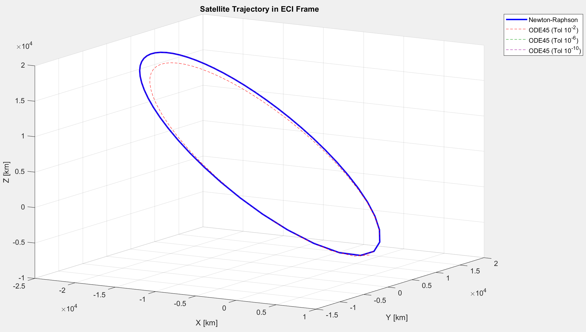
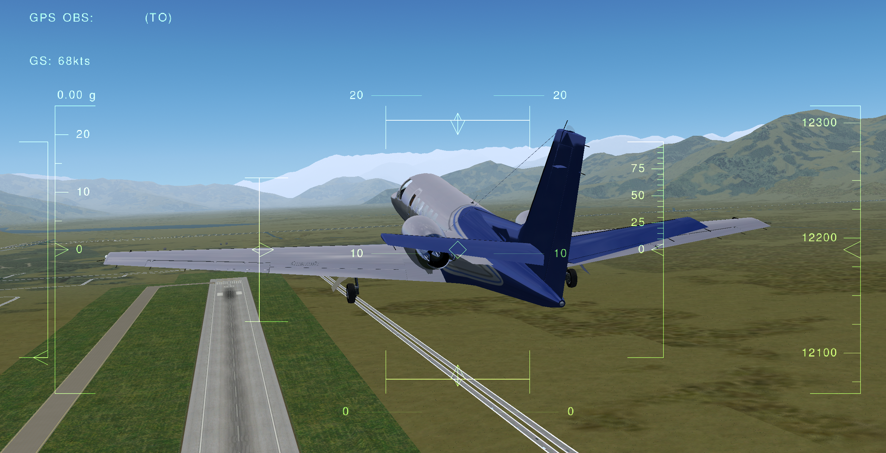

<link rel="preconnect" href="https://fonts.googleapis.com">
<link rel="preconnect" href="https://fonts.gstatic.com" crossorigin>
<link href="https://fonts.googleapis.com/css2?family=Inter:wght@400;500;600&family=Plus+Jakarta+Sans:wght@600;700;800&display=swap" rel="stylesheet">

<table style="width:100%; border-collapse:collapse; border:none; margin-bottom:20px;">
  <tr>
    <td style="width:60%; vertical-align:top; padding-right:35px; border:none;">
      <h2 style="font-size:1.8em; margin-top:20px; margin-bottom:10px;">
        About Me
      </h2>
      

        Hi, my name is Mohana Kumanan, and I am an aerospace engineering student with an interest in control systems and orbital mechanics. I have experience in technical analysis, collaborative engineering projects, MATLAB, Simulink, numerical methods, and spacecraft dynamics. This website serves as a technical portfolio documenting the engineering methodologies, analyses, and computational tools developed throughout my projects.
      

    </td>

    <td style="width:40%; vertical-align:top; border:none;">
      <h2 style="font-size:1.8em; margin-top:20px; margin-bottom:18px;">
        Technical Skills
      </h2>

      

        <h3>Programming</h3>
        

          MATLAB
          Python
          C++
        

      

      

        <h3>Software</h3>
        

          Simulink
          Stateflow
          SolidWorks
          Ansys
          FlightGear
          STAR-CCM+
          Altium
        

      

    </td>
  </tr>
</table>

<h2 style="font-size: 1.8em; margin-bottom: 6px;">
  Projects
</h2>

<h3 style="font-size: 1.4em; margin-bottom: 10px; text-align: center;">
  Kepler’s Problem Solver & Orbital Propagation
</h3>

  

    <ul style="color:#475569; line-height:1.6; margin-top:6px; margin-bottom:12px; padding-left:20px;">
      <li>Solved Kepler's equation using the Newton–Raphson iterative method.</li>
      <li>Computed Classical Orbital Elements (COEs).</li>
      <li>Verified conservation of orbital energy and angular momentum.</li>
      <li>Transformed states between perifocal and ECI reference frames.</li>
    </ul>

    <a href="kepler-solver.html" class="project-button">
      View More Details
    </a>
  

  

    
    

      Comparison of Newton-Raphson to ODE45
    

  

<h3 style="font-size: 1.4em; margin-bottom: 10px; text-align: center;">
  Pitch Autopilot Controller Model
</h3>

  

    <ul style="color:#475569; line-height:1.6; margin-top:6px; margin-bottom:12px;">
      <li>Designed a PID controller with anti-windup and actuator dynamics.</li>
      <li>Implemented Kalman filtering for robust state estimation.</li>
      <li>Evaluated controller performance using step, doublet, and square-wave reference inputs.</li>
      <li>Visualized aircraft response through real-time FlightGear 6DOF simulation.</li>
    </ul>

    <a href="pitch-controller.html" class="project-button">
      View More Details
    </a>
  

  

    
    

      Closed-Loop Pitch Controller in Action
    

  

